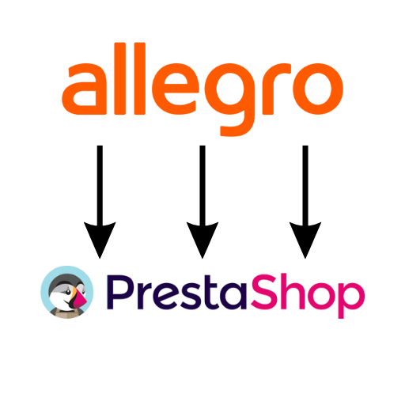

<!-- PROJECT LOGO -->
<br />
<p align="center">
  <a href="https://github.com/ggfunnn/Allegro2PrestashopI">
    
  </a>

  <h3 align="center">Allegro2Prestashop</h3>

  <p align="center">
    Sync Allegro prices with Prestashop
    <br />
    <br />
    <a href="https://github.com/ggfunnn/Allegro2Prestashop/releases">Download</a>
    ·
    <a href="https://github.com/ggfunnn/Allegro2Prestashop/issues">Report Bug</a>
    ·
    <a href="https://github.com/ggfunnn/Allegro2Prestashop/issues">Request Feature</a>
  </p>
</p>


<!-- TABLE OF CONTENTS -->
<details open="open">
  <summary>Table of Contents</summary>
  <ol>
    <li>
      <a href="#about-the-project">About The Project</a>
      <ul>
        <li><a href="#built-with">Built With</a></li>
      </ul>
    </li>
    <li>
      <a href="#getting-started">Getting Started</a>
      <ul>
        <li><a href="#prerequisites">Prerequisites</a></li>
        <li><a href="#installation">Installation</a></li>
      </ul>
    </li>
    <li><a href="#usage">Usage</a></li>
    <li><a href="#contributing">Contributing</a></li>
    <li><a href="#license">License</a></li>
    <li><a href="#contact">Contact</a></li>
    <li><a href="#acknowledgements">Acknowledgements</a></li>
  </ol>
</details>


<!-- ABOUT THE PROJECT -->
## About The Project

This tool allows you to synchronize prices from Allegro with Prestashop store. Synchronization is done through APIs of both services.
You should consider using it when you:
* prefer to change prices only by using Allegro
* synchronize prices with other marketplaces using Baselinker system
* do not have any kind of synchronizing software.


### Built With

* Python


<!-- GETTING STARTED -->
## Getting Started

### Docker installation
The recommended method for running this program is to deploy it using Docker container. 
It's available for Windows, Linux and macOS users.

1. Install docker on your system. There are plenty of tutorials available on the web on how to do it.
   
2. Clone the repo
   ```sh
   git clone https://github.com/ggfunnn/Allegro2Prestashop.git
   ```
2. Change your working directory to the Allegro2Prestashop directory. In Linux for example:
   ```sh
   cd Allegro2Prestashop
   ```
3. Build the image
   ```sh
   docker build -t gg_fun/Allegro2Prestashop .
   ```
   
4. Create a new volume for config
   ```sh
   docker volume create Allegro2Prestashop
   ```

4. Start the container
   ```sh
   docker run -v Allegro2Prestashop:/usr/src/app/config --name CHANGE_NAME_HERE --rm -it gg_fun/Allegro2Prestashop
   ```

### Manual Installation
If you wish to install the program manually, you can do it by cloning the repository directly from GitHub.

#### Prerequisites
To run application you need:

* Python 3.6 or higher
* Requests 2.27.1 or higher*
* Urllib3 1.26.9 or higher*

*these packages are included in the requirements.txt file.

1. Clone the repo
   ```sh
   git clone https://github.com/ggfunnn/Allegro2Prestashop.git
   ```
2. Change your working directory to the Allegro2Prestashop directory
   ```sh
   cd Allegro2Prestashop
   ```
3. Run the application
   ```JS
   python3 run.py
   ```


<!-- CONFIGURATION -->
## Configuration
**Warning! Before using the program, please fill in the config file.**

[![Allegro2Prestashop Config][app_config]](https://github.com/ggfunnn/DGCS2EDI)


<!-- CONTRIBUTING -->
## Contributing

Contributions are what make the open source community such an amazing place to be learn, inspire, and create. Any contributions you make are **greatly appreciated**.

1. Fork the Project
2. Create your Feature Branch (`git checkout -b feature/AmazingFeature`)
3. Commit your Changes (`git commit -m 'Add some AmazingFeature'`)
4. Push to the Branch (`git push origin feature/AmazingFeature`)
5. Open a Pull Request


<!-- LICENSE -->
## License

Distributed under the MIT License. See `LICENSE.txt` for more information.


<!-- CONTACT -->
## Contact

Jakub Grzesista - [@gg_funnn](https://twitter.com/gg_funnn) - kubagrzesista@gmail.com

Project Link: [https://github.com/ggfunnn/Allegro2Prestashop](https://github.com/ggfunnn/Allegro2Prestashop)


<!-- ACKNOWLEDGEMENTS -->
## Acknowledgements
* [Best-README-Template](https://github.com/othneildrew/Best-README-Template)
* [Requests](https://github.com/psf/requests)
* [Urllib3](https://github.com/urllib3/urllib3)


<!-- MARKDOWN LINKS & IMAGES -->
[app_config]: img/config.png